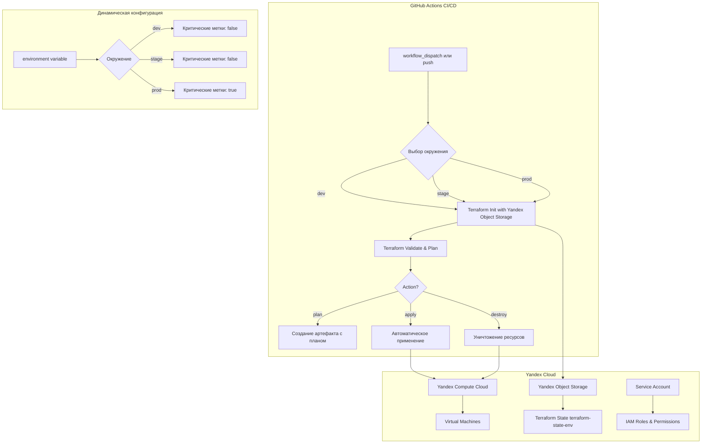

# Task 2: Консолидированная инфраструктура с CI/CD и удалённым состоянием

Автоматизированное развёртывание инфраструктуры через GitHub Actions с использованием единой конфигурации для всех окружений и удалённого состояния в Yandex Object Storage.

## 🆕 **Важные изменения после консолидации**

### Структура:
```
task2Advanced/              # Единая конфигурация для всех окружений
├── main.tf                 # Основная конфигурация модуля VM
├── variables.tf            # Переменные (включая environment)
├── backend.tf              # Partial backend configuration
├── provider.tf             # Провайдер Yandex Cloud
├── outputs.tf              # Выходные значения
├── dev.tfvars              # Локальные значения для тестирования (gitignored)
├── .gitignore              # Игнорирование чувствительных файлов
├── .github/workflows/      # GitHub Actions workflows
│   └── terraform-ci.yml   # Обновлённый CI/CD pipeline
├── modules/vm/             # Модуль ВМ (без изменений)
│   ├── main.tf
│   ├── variables.tf
│   ├── outputs.tf
│   └── providers.tf
└── README.md              # Эта документация
```

## 🏗️ **Архитектура решения**



## 📁 **Структура файлов и их назначение**

### Основные файлы конфигурации:

| Файл | Назначение |
|------|------------|
| `main.tf` | Вызов модуля `vm` с динамическими метками и конфигурацией |
| `variables.tf` | Все переменные, включая `environment` для выбора окружения |
| `backend.tf` | Частичная конфигурация S3 backend для Yandex Object Storage |
| `provider.tf` | Конфигурация провайдера Yandex Cloud |
| `outputs.tf` | Выходные значения (IP адреса, IDs) |
| `dev.tfvars` | Локальные значения переменных для тестирования (не коммитится) |

### Модуль VM (`modules/vm/`):
- `main.tf` - ресурсы виртуальной машины, дисков, сети
- `variables.tf` - входные переменные модуля
- `outputs.tf` - выходные значения модуля
- `providers.tf` - конфигурация провайдеров внутри модуля

## 🔧 **Настройка окружений**

### Переменная `environment`
Центральная переменная, определяющая окружение:
```hcl
variable "environment" {
  description = "Окружение (dev, stage, prod)"
  type        = string
  default     = "dev"
}
```


## 🔐 **Настройка GitHub Secrets**

### Обязательные для всех окружений:
| Secret Name | Описание | Как получить |
|-------------|----------|--------------|
| `YC_TOKEN` | IAM-токен для аутентификации | `yc iam create-token` |
| `YC_CLOUD_ID` | Cloud ID | `yc config get cloud-id` |
| `YC_ACCESS_KEY` | Access key для Object Storage | `yc iam access-key create` |
| `YC_SECRET_KEY` | Secret key для Object Storage | Выдаётся с access key |
| `SSH_PUBLIC_KEY` | Публичный SSH ключ | `cat ~/.ssh/id_rsa.pub` |
| `IMAGE_ID` | ID образа системы | `yc compute image list` |

### Окружение-specific secrets (для каждого отдельно):
| Secret Name | Описание |
|-------------|----------|
| `YC_FOLDER_ID_DEV` | ID folder для dev окружения |
| `YC_FOLDER_ID_STAGE` | ID folder для stage окружения |
| `YC_FOLDER_ID_PROD` | ID folder для prod окружения |
| `SUBNET_ID_DEV` | ID подсети для dev окружения |
| `SUBNET_ID_STAGE` | ID подсети для stage окружения |
| `SUBNET_ID_PROD` | ID подсети для prod окружения |

## 🚀 **CI/CD Pipeline (.github/workflows/terraform-ci.yml)**

### Триггеры workflow:
1. **Push в main ветку** - автоматический plan и apply для dev окружения
2. **Pull Request** - validation и plan для проверки изменений
3. **workflow_dispatch** - ручной запуск с выбором окружения и действия

### Доступные действия при workflow_dispatch:
- **plan** - создание плана изменений (без применения)
- **apply** - применение изменений (после плана)
- **destroy** - уничтожение ресурсов

### Этапы pipeline:
1. **Checkout** - получение кода репозитория
2. **Setup Terraform** - установка Terraform 1.5.0
3. **Create backend configuration** - генерация `backend-config.hcl`
4. **Terraform Init** - инициализация с remote backend
5. **Terraform Validate** - валидация конфигурации
6. **Terraform Plan** - создание плана изменений
7. **Upload Terraform Plan** - сохранение плана как артефакт
8. **Terraform Apply** - применение изменений (при определённых условиях)
9. **Terraform Destroy** - уничтожение ресурсов (только manual)


## 💾 **Удалённый backend (Yandex Object Storage)**

### Конфигурация backend.tf:
```hcl
terraform {
  backend "s3" {
    endpoint = "https://storage.yandexcloud.net"
    key      = "terraform.tfstate"
    region   = "ru-central1"
    
    # Ключи доступа передаются через -backend-config
    skip_region_validation      = true
    skip_credentials_validation = true
    skip_metadata_api_check     = true
    use_path_style              = true
  }
}
```

### Создание bucket для состояния:
```bash
# Bucket создаётся заранее для каждого окружения
yc storage bucket create --name terraform-state-dev
```

### Динамическое имя bucket:
- `terraform-state-dev` - для dev окружения
- `terraform-state-stage` - для stage окружения  
- `terraform-state-prod` - для prod окружения

## 🧪 **Локальное тестирование**

### 1. Тестирование с dev.tfvars:
```bash
cd task2Advanced
terraform init
terraform plan -var-file="dev.tfvars"
```

### 2. Тестирование с переменными окружения:
```bash
cd task2Advanced
export TF_VAR_environment=dev
export TF_VAR_yc_token="your-token"
export TF_VAR_yc_cloud_id="your-cloud-id"
export TF_VAR_yc_folder_id="your-folder-id"
terraform plan
```

### 3. Тестирование разных окружений:
```bash
# Для stage окружения
export TF_VAR_environment=stage
export TF_VAR_yc_folder_id="your-stage-folder-id"
export TF_VAR_subnet_id="your-stage-subnet-id"
terraform plan

# Для prod окружения  
export TF_VAR_environment=prod
export TF_VAR_yc_folder_id="your-prod-folder-id"
export TF_VAR_subnet_id="your-prod-subnet-id"
terraform plan
```


## 🔒 **Безопасность**
### Изоляция окружений:
- Раздельные state файлы в разных bucket
- Разные Yandex Cloud folders для каждого окружения
- Отдельные GitHub environment contexts
- Разные IAM роли и permissions

