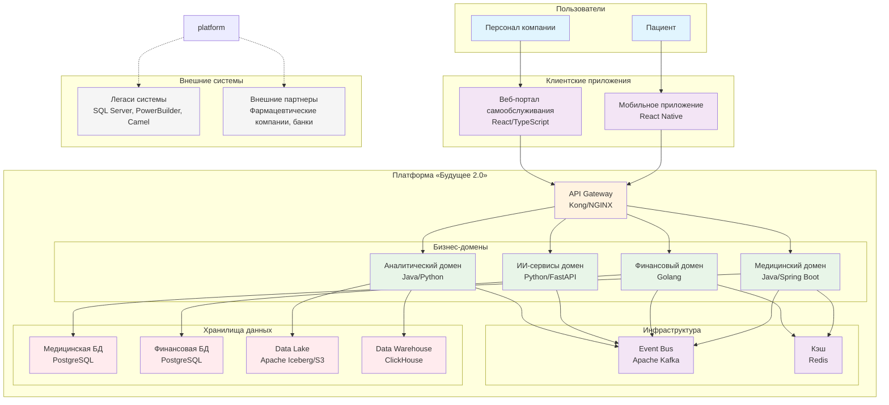
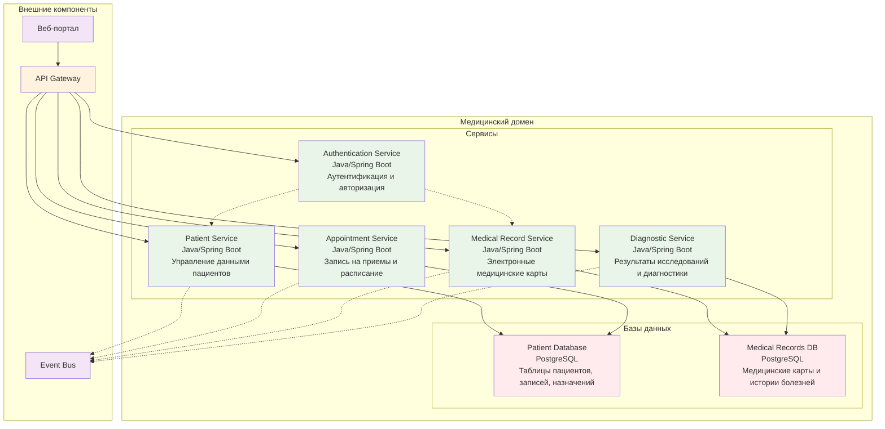
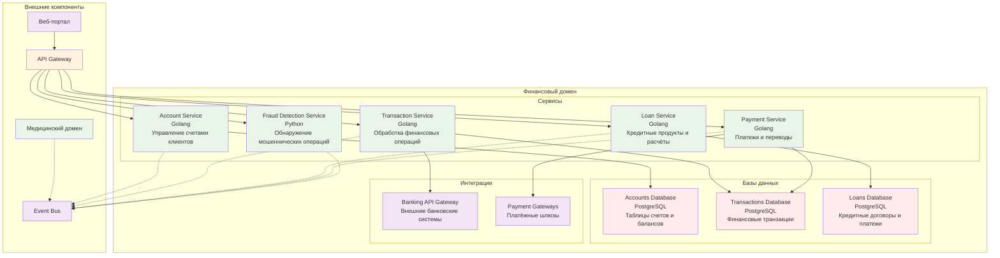
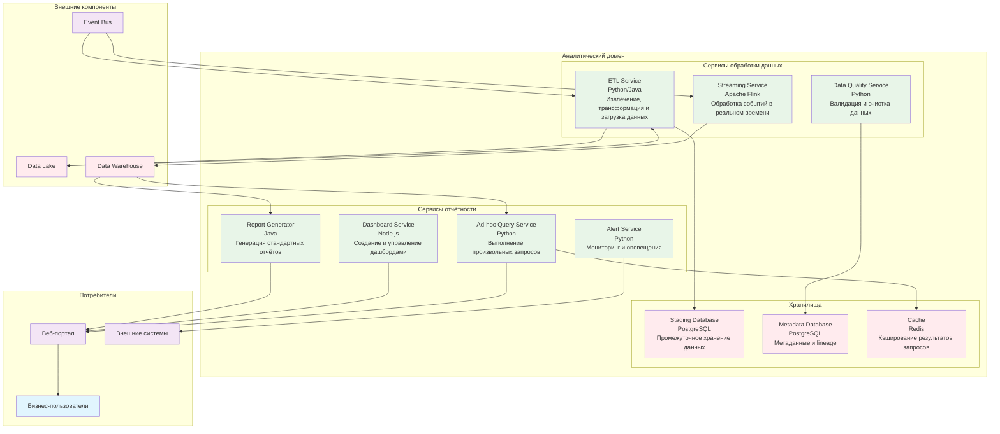

# Task 3: Проектирование целевой архитектуры и оценка рисков внедрения

## Уровень 2: Диаграмма контейнеров

## Уровень 3: Диаграмма компонентов (Медицинский домен)

#### Финансовый домен (уровень компонентов):

#### Аналитический домен (уровень компонентов):

#### Ключевые контейнеры:

1. **Веб-портал самообслуживания** - Single Page Application для бизнес-пользователей
2. **API Gateway** - Единая точка входа для всех клиентских запросов
3. **Event Bus** (Kafka/Pulsar) - Центральная шина событий для междоменного взаимодействия
4. **Медицинский домен** - Микросервисы для управления медицинскими данными
5. **Финансовый домен** - Микросервисы для банковских и финтех-операций
6. **ИИ-сервисы домен** - Сервисы машинного обучения и аналитики
7. **Аналитический домен** - Обработка данных и формирование отчётов
8. **Data Lake** - Централизованное хранилище сырых данных
9. **Data Warehouse** - Оптимизированное хранилище для аналитики

### Компоненты C4-модели (Уровень 3)

#### Медицинский домен:
- **Patient Service** - Управление данными пациентов
- **Appointment Service** - Запись на приёмы и расписание
- **Medical Record Service** - Электронные медицинские карты
- **Diagnostic Service** - Результаты исследований и диагностики

#### Финансовый домен:
- **Account Service** - Управление счетами клиентов
- **Transaction Service** - Обработка финансовых операций
- **Loan Service** - Кредитные продукты и расчёты
- **Payment Service** - Платежи и переводы

#### ИИ-сервисы домен:
- **ML Pipeline Service** - Обучение и развёртывание моделей
- **Prediction Service** - Прогнозирование и рекомендации
- **Image Analysis Service** - Анализ медицинских изображений
- **Natural Language Service** - Обработка текстовых данных

#### Аналитический домен:
- **ETL Service** - Извлечение, трансформация и загрузка данных
- **Report Generator** - Генерация стандартных отчётов
- **Ad-hoc Query Service** - Выполнение произвольных запросов
- **Dashboard Service** - Создание и управление дашбордами

### Технологический стек (3-летняя перспектива)

#### Облачная инфраструктура:
- **Yandex Cloud** (основная платформа)
- **Kubernetes** (оркестрация контейнеров)
- **Terraform** (инфраструктура как код)
- **GitHub Actions** (CI/CD)

#### Хранилища данных:
- **PostgreSQL** (операционные БД)
- **Apache Kafka** (стриминг событий)
- **Apache Iceberg** (Data Lake формат)
- **ClickHouse** (OLAP для аналитики)
- **Redis** (кэширование)

#### Бэкенд-технологии:
- **Java/Spring Boot** (основные бизнес-сервисы)
- **Python/FastAPI** (ИИ-сервисы и аналитика)
- **Golang** (высоконагруженные финансовые сервисы)
- **Node.js** (API Gateway и некоторые микросервисы)

#### Фронтенд:
- **React/TypeScript** (веб-портал)
- **React Native** (мобильные приложения)

### Эволюция архитектуры

#### Текущее состояние → Целевое состояние:
1. **Монолит DWH** → **Распределённые доменные сервисы**
2. **Пакетная обработка** → **Стриминговая обработка**
3. **Жёсткие интеграции** → **Событийное взаимодействие**
4. **Локальное развёртывание** → **Облачная нативная архитектура**
5. **Ручное управление** → **Полная автоматизация CI/CD**

#### Ключевые изменения:
- Замена SQL Server 2008 на современные СУБД
- Миграция с PowerBuilder на React-интерфейсы
- Замена Apache Camel на Kafka для интеграций
- Внедрение Data Lake вместо монолитного DWH
- Реализация self-service аналитики через портал

### Принципы архитектуры

1. **Доменно-ориентированное проектирование** - Чёткое разделение на медицинский, финансовый и ИИ-домены
2. **Event-Driven Architecture** - Все домены взаимодействуют через события
3. **Cloud-Native** - Использование облачных сервисов и контейнеризации
4. **Data Mesh** - Децентрализованное владение данными доменами
5. **Zero-Trust Security** - Строгая аутентификация и авторизация
6. **Observability** - Полная наблюдаемость через метрики, логи и трассировку