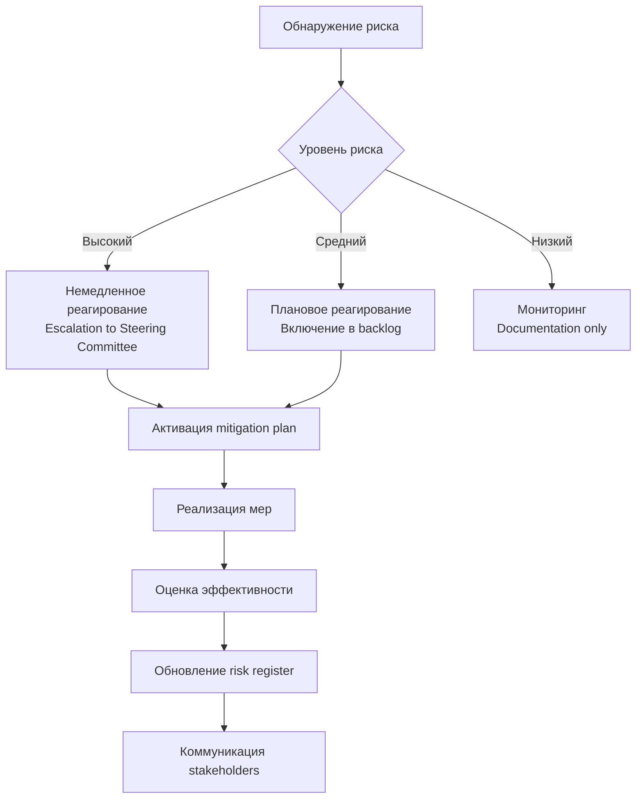

# План управления рисками трансформации архитектуры «Будущего 2.0»

## Общий подход к управлению рисками

Управление рисками осуществляется по методологии **проактивного мониторинга и превентивных мер**. Для каждого риска определены:
- **Меры снижения** (профилактические действия)
- **Меры реагирования** (действия при наступлении риска)
- **Ответственные** (роли и команды)
- **Сроки** (временные рамки реализации мер)

## Меры по снижению архитектурных рисков

### AR-01: Недостаточная производительность распределённой архитектуры

**Технические меры:**
1. Внедрение распределённого кэширования (Redis Cluster)
2. Использование асинхронных коммуникаций через message queue
3. Реализация Circuit Breaker и Retry механизмов
4. Проведение нагрузочного тестирования на ранних этапах

**Управленческие меры:**
1. Поэтапный переход с мониторингом метрик производительности
2. Создание performance SLA для критичных сервисов

**Ответственные:** Архитекторы, DevOps
**Сроки:** Постоянно в течение всего проекта

### AR-02: Сложность обеспечения консистентности данных

**Технические меры:**
1. Реализация Saga Pattern для распределённых транзакций
2. Внедрение Event Sourcing для критичных бизнес-процессов
3. Использование Change Data Capture для синхронизации данных
4. Создание компенсирующих транзакций для отката операций

**Управленческие меры:**
1. Чёткое определение bounded context для каждого домена
2. Документирование контрактов событий между доменами

**Ответственные:** Архитекторы, Backend разработчики
**Сроки:** 6-12 месяцев

### AR-04: Сложность миграции данных из легаси-систем

**Технические меры:**
1. Реализация dual-write стратегии в переходный период
2. Создание миграционных скриптов с валидацией данных
3. Использование инструментов CDC для инкрементальной миграции
4. Реализация механизма сравнения данных между старой и новой системами

**Управленческие меры:**
1. Поэтапная миграция по доменам (сначала не критичные данные)
2. Создание rollback плана на случай неудачи миграции
3. Проведение пилотных миграций на тестовых наборах данных

**Ответственные:** Data Engineering команда, DBA
**Сроки:** 6-12 месяцев

### AR-06: Сложность миграции интеграционной логики с ESB Apache Camel на event-driven архитектуру

**Технические меры:**
1. Поэтапный переход: создание legacy-адаптеров, которые подключаются к существующим системам и публикуют события в Kafka
2. Реализация схемы данных (Schema Registry) для обеспечения контрактов между системами
3. Создание отдельных интеграционных сервисов для сложных трансформаций и ФЛК (функционально-логического контроля)
4. Использование легковесных интеграционных бибилотек внутри доменных сервисов для простых интеграций (Spring Integration)
5. Регулярная сверка данных приходящих по legacy шине и по новым интеграциям(Можно отсылать одни и те же тестовые данные/события для проверки корректности реализаций интеграций)   

**Управленческие меры:**
1. Инвентаризация всех интеграционных потоков в текущем ESB
2. Классификация интеграций по критичности и сложности для определения порядка миграции
3. Создание cross-functional team с экспертами по legacy-системам и новым технологиям
4. Поэтапная миграция интеграций с параллельной работой старого и нового решений

**Ответственные:** Integration Team, Архитекторы, Backend разработчики
**Сроки:** 12-18 месяцев

## Меры по снижению организационных рисков

### OR-01: Сопротивление изменениям со стороны персонала

**Управленческие меры:**
1. Поэтапное обучение пользователей новым интерфейсам
2. Создание отдельной группы из продвинутых пользователей(к которым потом можно будет приходить за помощью(за доплату))
3. Регулярные демонстрации преимуществ новой системы

**Технические меры:**
1. Сохранение (по возможности) знакомых паттернов взаимодейстия в новых интерфейсах
2. Реализация буткэмпа и интерактивной документации
3. Сбор обратной связи от пользователей

**Ответственные:** HR, Product Owners, UX команда
**Сроки:** Начало за 3 месяца до внедрения, продолжение 6 месяцев после

### OR-02: Недостаток квалификации для работы с cloud-native технологиями

**Управленческие меры:**
1. Программа обучения и сертификации сотрудников
2. Создание внутренней базы знаний и best practices
3. Code review опытными разработчиками

**Технические меры:**
1. Стандартизация технологического стека
2. Создание внутренних boilerplate проектов и шаблонов
3. Автоматизация рутинных операций через CI/CD

**Ответственные:** CTO, Team Leads, HR
**Сроки:** 3-6 месяцев подготовки, постоянное развитие

## Меры по снижению технологических рисков

### TR-02: Сложность обеспечения безопасности в распределённой системе

**Технические меры:**
1. Внедрение Zero-Trust архитектуры с mutual TLS
2. Реализация централизованного управления секретами (HashiCorp Vault)
3. Использование service mesh (Istio) для security policies
4. Регулярные проверки безоапсности(автоматическое тестирование) и привлечение внешних специалистов по пентесту

**Управленческие меры:**
1. Покупка курсов для разработчиков
2. Выделение отдельных разработчиков(самых продвинутых) для передачи опыта дальше в команды
3. Мастер-классы/мини-конференции внутри компании

**Ответственные:** Security Team, DevOps, все разработчики
**Сроки:** Постоянно, с акцентом на первые 6 месяцев

### TR-05: Несовместимость с регуляторными требованиями

**Технические меры:**
1. Реализация data masking и encryption at rest для чувствительных данных
2. Внедрение аудита для всех операций с данными
3. Создание data retention policies и автоматического удаления
4. Реализация role-based access control с fine-grained permissions

**Ответственные:** Security Team, Product Owners
**Сроки:** Постоянно

## Меры по снижению рисков данных

### DR-05: Сложность обеспечения near-real-time обработки

**Технические меры:**
1. Поэтапный переход: batch → micro-batch → streaming
2. Использование Apache Flink для сложной потоковой обработки
3. Реализация lambda architecture для hybrid processing
4. Оптимизация данных для streaming (Avro/Protobuf схемы)

**Управленческие меры:**
1. Чёткое определение требований к latency для каждого use case
2. Приоритизация use cases для перехода на streaming
3. Создание метрик для мониторинга качества streaming данных

**Ответственные:** Data Engineering, Архитекторы
**Сроки:** 12-24 месяца поэтапного внедрения

## План мониторинга и реагирования

### Мониторинг рисков
1. **Еженедельные risk review meetings** с участием ключевых стейкхолдеров
2. **Risk dashboard** с автоматическим сбором метрик
3. **Early warning indicators** для каждого критического риска
4. **Регулярные health checks** архитектуры и процессов

### Процесс реагирования на риски

## Заключение

Успешное управление рисками требует комбинации технических и управленческих подходов. Критически важными являются:
1. **Раннее вовлечение** всех стэйкхолдеров
2. **Поэтапный подход** к трансформации с постоянной обратной связью и переосмыслением первичного плана
3. **Инвестиции в людей** через обучение
4. **Непрерывный мониторинг**