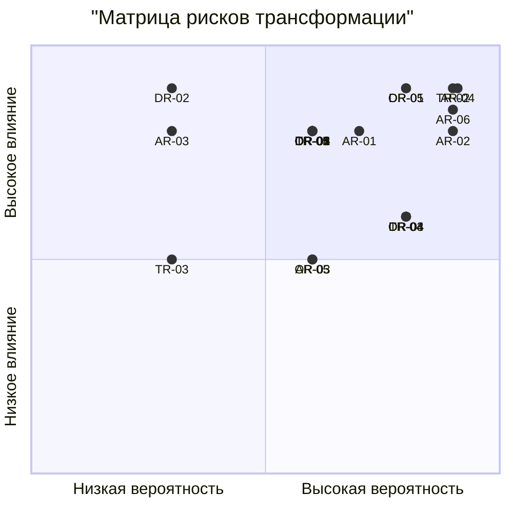

# Карта рисков трансформации архитектуры «Будущего 2.0»

## Методология оценки рисков

Каждый риск оценивается по двум параметрам:
- **Вероятность** (низкая, средняя, высокая)
- **Влияние на бизнес** (низкое, среднее, высокое)

Матрица приоритетов:
- **Высокий приоритет**: Высокая вероятность × Высокое влияние
- **Средний приоритет**: Средняя вероятность × Среднее влияние или комбинации
- **Низкий приоритет**: Низкая вероятность × Низкое влияние

## Архитектурные риски

| ID | Риск | Категория | Вероятность | Влияние | Описание |
|----|------|-----------|-------------|---------|----------|
| AR-01 | Недостаточная производительность распределённой архитектуры | Архитектурный | Средняя | Высокое | Переход от монолитного DWH к микросервисам может привести к проблемам с производительностью из-за сетевых задержек и сложности координации |
| AR-02 | Сложность обеспечения консистентности данных в event-driven архитектуре | Архитектурный | Высокая | Высокое | В распределённой системе с асинхронной обработкой событий сложно гарантировать консистентность данных между доменами |
| AR-03 | Недостаточная масштабируемость при росте нагрузки | Архитектурный | Низкая | Высокое | Архитектура может не справиться с резким увеличением нагрузки при выходе на новые регионы |
| AR-04 | Сложность миграции данных из легаси-систем | Архитектурный | Высокая | Высокое | Миграция сотен терабайт данных из SQL Server 2008 в современные хранилища сопряжена с техническими сложностями и рисками потери данных |
| AR-05 | Несовместимость новых и старых систем в переходный период | Архитектурный | Средняя | Среднее | Параллельная работа старого и нового ландшафта требует сложных интеграционных мостов и увеличивает операционные расходы |
| AR-06 | Сложность миграции интеграционной логики с ESB Apache Camel на event-driven архитектуру | Архитектурный | Высокая | Высокое | Переход от централизованного ESB к распределённой event-driven архитектуре требует перепроектирования интеграционной логики, ФЛК, трансформаций и протокольной адаптации |

## Организационные риски

| ID | Риск | Категория | Вероятность | Влияние | Описание |
|----|------|-----------|-------------|---------|----------|
| OR-01 | Сопротивление изменениям со стороны персонала | Организационный | Высокая | Высокое | Медицинский и финансовый персонал, привыкший к PowerBuilder, может сопротивляться переходу на новые интерфейсы и процессы |
| OR-02 | Недостаток квалификации для работы с cloud-native технологиями | Организационный | Средняя | Высокое | Существующая IT-команда имеет опыт работы с традиционными технологиями, но не обладает достаточными знаниями в области Kubernetes, Kafka, современных СУБД |
| OR-03 | Конфликт интересов между доменами | Организационный | Средняя | Среднее | Медицинский, финансовый и ИИ-домены могут иметь противоречивые требования к архитектуре и приоритетам развития |
| OR-04 | Недостаточное вовлечение бизнес-пользователей | Организационный | Высокая | Среднее | Бизнес-пользователи могут не участвовать активно в разработке портала самообслуживания, что приведёт к созданию неполезного продукта |
| OR-05 | Нарушение сроков из-за организационной сложности | Организационный | Средняя | Высокое | Трансформация затрагивает все подразделения компании, что увеличивает координационные издержки и риск срыва сроков |

## Технологические риски

| ID | Риск | Категория | Вероятность | Влияние | Описание |
|----|------|-----------|-------------|---------|----------|
| TR-01 | Зависимость от конкретных облачных провайдеров | Технологический | Средняя | Высокое | Привязка к Yandex Cloud создаёт вендор-локи и усложняет возможную миграцию на другую платформу |
| TR-02 | Сложность обеспечения безопасности в распределённой системе | Технологический | Высокая | Высокое | Микросервисная архитектура увеличивает поверхность атаки и усложняет управление доступом к данным |
| TR-03 | Недостаточная надёжность новых технологий | Технологический | Низкая | Среднее | Некоторые выбранные технологии (Kafka, ClickHouse) могут иметь скрытые проблемы стабильности в production-среде |
| TR-04 | Сложность мониторинга и отладки распределённой системы | Технологический | Высокая | Среднее | В системе из десятков микросервисов сложно отслеживать performance issues и дебажить проблемы |
| TR-05 | Несовместимость с регуляторными требованиями | Технологический | Средняя | Высокое | Медицинские и финансовые данные подлежат строгому регулированию (ФЗ-152, PCI DSS), новая архитектура должна соответствовать всем требованиям |

## Риски данных

| ID | Риск | Категория | Вероятность | Влияние | Описание |
|----|------|-----------|-------------|---------|----------|
| DR-01 | Потеря данных при миграции | Данные | Средняя | Высокое | В процессе переноса сотен терабайт возможны потери или corruption данных |
| DR-02 | Нарушение конфиденциальности медицинских данных | Данные | Низкая | Высокое | Неправильная настройка доступа может привести к утечке чувствительной медицинской информации |
| DR-03 | Некачественные данные в новой системе | Данные | Высокая | Среднее | Проблемы с ETL-процессами могут привести к накоплению ошибок в аналитических витринах |
| DR-04 | Недостаточная производительность аналитических запросов | Данные | Средняя | Высокое | Сложные отчёты могут выполняться медленно даже в новой архитектуре |
| DR-05 | Сложность обеспечения near-real-time обработки | Данные | Высокая | Высокое | Переход от batch к streaming обработке требует значительных изменений в подходах к работе с данными |

## Визуальная матрица рисков

## Топ-6 критических рисков

1. **AR-04 + DR-01** - Сложность миграции данных из легаси-систем с риском потери данных
2. **TR-02** - Сложность обеспечения безопасности в распределённой системе
3. **OR-01** - Сопротивление изменениям со стороны персонала
4. **DR-05** - Сложность обеспечения near-real-time обработки
5. **AR-06** - Сложность миграции интеграционной логики с ESB Apache Camel на event-driven архитектуру
5. **AR-02** - Сложность обеспечения консистентности данных в event-driven архитектуре

## Заключение

Наиболее критичными являются риски, связанные с миграцией данных и обеспечением безопасности. Организационные риски также имеют высокую значимость, так как успех трансформации во многом зависит от готовности персонала к изменениям. Технологические риски в основном управляемы при наличии квалифицированной команды и правильного подхода к внедрению.