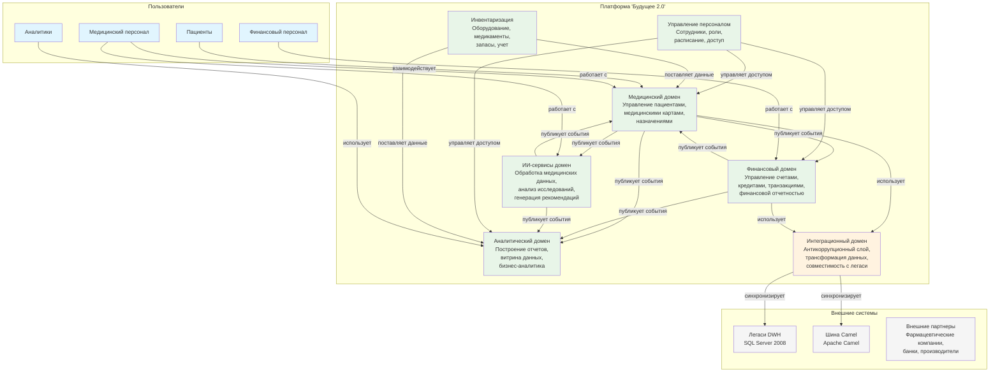

# Схема Bounded Contexts для компании "Будущее 2.0"

## Обзор доменов

На основе анализа бизнес-требований и существующей архитектуры определены следующие bounded contexts:

### 1. Медицинский домен (Medical Domain)
**Ответственность**: Управление пациентами, медицинскими картами, назначениями, диагностическими исследованиями и лечением.
**Ключевые сущности**: Пациент, Медицинская карта, Назначение, Диагностическое исследование, Лечение.

### 2. Финансовый домен (Financial Domain)  
**Ответственность**: Управление счетами, кредитами, транзакциями, финансовой отчетностью и банковскими операциями.
**Ключевые сущности**: Счет, Кредитный договор, Транзакция, Клиент (финансовый), Финансовая отчетность.

### 3. ИИ-сервисы домен (AI Services Domain)
**Ответственность**: Обработка медицинских данных с помощью искусственного интеллекта, анализ диагностических исследований, генерация рекомендаций.
**Ключевые сущности**: Модель ИИ, Результат анализа, Диагностическое изображение, Рекомендация.

### 4. Аналитический домен (Analytics Domain)
**Ответственность**: Построение отчетов, витрина данных самообслуживания, бизнес-аналитика и мониторинг ключевых показателей.
**Ключевые сущности**: Отчет, Дашборд, Показатель эффективности (KPI), Срез данных.

### 5. Управление персоналом (Staff Management Domain)
**Ответственность**: Управление сотрудниками, доступом, ролями, расписанием работы и компетенциями.
**Ключевые сущности**: Сотрудник, Роль, Расписание, Отдел, Компетенция.

### 6. Инвентаризация (Inventory Domain)
**Ответственность**: Управление медицинским оборудованием, запасами медикаментов, расходными материалами и их учетом.
**Ключевые сущности**: Оборудование, Медикамент, Запас, Заказ, Инвентарная запись.

### 7. Интеграционный домен (Integration Domain)
**Ответственность**: Антикоррупционный слой для интеграции с легаси-системами (Camel, DWH), трансформация данных, обеспечение совместимости.
**Ключевые сущности**: Коннектор, Трансформация, Схема данных, Мониторинг интеграций.

## Диаграмма Bounded Contexts

## Контекстные карты и отношения

### Сотрудничающие контексты (Partnership)
- **Медицинский домен ↔ ИИ-сервисы домен**: Тесное сотрудничество для анализа медицинских данных
- **Медицинский домен ↔ Финансовый домен**: Интеграция для биллинга и страховых выплат
- **Все домены ↔ Аналитический домен**: Предоставление данных для аналитики

### Консьюмер-поставщик (Customer-Supplier)
- **Управление персоналом → Все домены**: Поставка данных о сотрудниках и управление доступом
- **Инвентаризация → Медицинский домен**: Поставка данных об оборудовании и медикаментах

### Отдельные пути (Separate Ways)
- **Интеграционный домен**: Работает изолированно как антикоррупционный слой
- **Легаси-системы**: Сохраняются временно для обратной совместимости

### Общий язык (Shared Kernel)
- **Общие модели данных**: Определены общие схемы для событий и API
- **Стандарты безопасности**: Единые подходы к аутентификации и авторизации

## Принципы взаимодействия

1. **Событийная архитектура**: Все домены взаимодействуют через публикацию и подписку на события
2. **Асинхронная коммуникация**: Использование message broker (Apache Kafka) для обеспечения отказоустойчивости
3. **Локальная автономия**: Каждый домен управляет своими данными и бизнес-логикой
4. **Явные контракты**: Четко определенные схемы событий и API
5. **Обратная совместимость**: Поддержка старых версий событий в течение миграционного периода