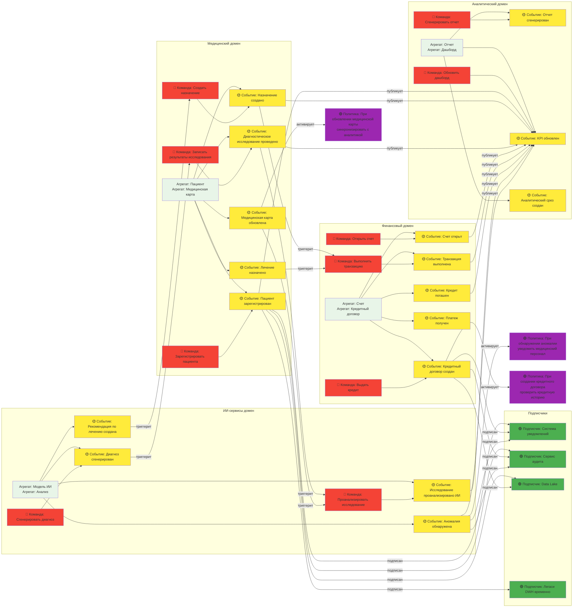

# Event Storming диаграмма для компании "Будущее 2.0"

## Обзор событийной архитектуры

Event Storming диаграмма отображает ключевые доменные события, их источники и подписчиков в рамках событийной архитектуры платформы "Будущее 2.0".

### Легенда диаграммы
- 🟡 **Событие (Event)**: Доменное событие, произошедшее в системе
- 🔵 **Агрегат (Aggregate)**: Источник события (агрегат, который публикует событие)
- 🟢 **Подписчик (Subscriber)**: Домен или сервис, который подписывается на событие
- 🔴 **Команда (Command)**: Действие, которое инициирует изменение состояния
- 🟣 **Политика (Policy)**: Бизнес-правило, которое реагирует на события

## Диаграмма Event Storming



## Ключевые потоки событий

### 1. Регистрация пациента и создание финансового счета
```
Пользователь → [Зарегистрировать пациента] → Медицинский домен
Медицинский домен → [Пациент зарегистрирован] → Событие
Финансовый домен ← Подписка на событие → [Открыть счет]
Финансовый домен → [Счет открыт] → Событие
Аналитический домен ← Подписка на оба события → [Обновить KPI]
```

### 2. Диагностическое исследование и ИИ-анализ
```
Врач → [Записать результаты исследования] → Медицинский домен
Медицинский домен → [Диагностическое исследование проведено] → Событие
ИИ-сервисы домен ← Подписка на событие → [Проанализировать исследование]
ИИ-сервисы домен → [Исследование проанализировано ИИ] → Событие
Медицинский домен ← Подписка на событие → [Обновить медицинскую карту]
```

### 3. Кредитная операция и аналитика
```
Клиент → [Выдать кредит] → Финансовый домен
Финансовый домен → [Кредитный договор создан] → Событие
Аналитический домен ← Подписка на событие → [Обновить финансовые отчеты]
Система уведомлений ← Подписка на событие → [Отправить уведомление]
```

## Матрица событий и подписчиков

| Событие | Источник (домен) | Основные подписчики | Назначение |
|---------|------------------|---------------------|------------|
| Пациент зарегистрирован | Медицинский | Финансовый, Аналитический, Система уведомлений | Создание счета, обновление статистики, уведомление |
| Диагностическое исследование проведено | Медицинский | ИИ-сервисы, Аналитический | Анализ ИИ, обновление медицинской статистики |
| Кредитный договор создан | Финансовый | Аналитический, Система уведомлений, Сервис аудита | Финансовая отчетность, уведомления, аудит |
| Исследование проанализировано ИИ | ИИ-сервисы | Медицинский, Аналитический | Обновление диагноза, исследовательская аналитика |
| Аномалия обнаружена | ИИ-сервисы | Система уведомлений, Медицинский | Экстренное уведомление, пересмотр диагноза |
| Отчет сгенерирован | Аналитический | Data Lake, Легаси DWH | Долгосрочное хранение, обратная совместимость |

## Принципы проектирования событий

1. **Иммutability событий**: События неизменяемы после публикации
2. **Семантическое версионирование**: Схемы событий имеют версии для обратной совместимости
3. **Гарантия доставки**: Использование persistent storage для событий
4. **Идемпотентность обработки**: Подписчики должны обрабатывать события идемпотентно
5. **Мониторинг и observability**: Все события логируются и отслеживаются
6. **DLQ (Dead Letter Queue)**: Обработка неудачных событий через отдельные очереди