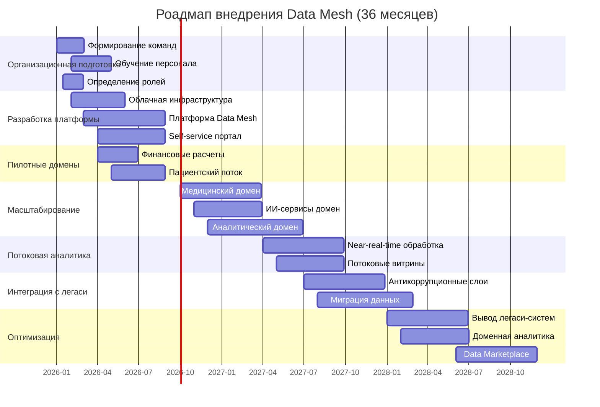

# Стратегический роадмап внедрения Data Mesh

## Введение
Данный роадмап описывает поэтапное внедрение архитектуры Data Mesh в компании "Будущее 2.0" на горизонте трех лет. Роадмап включает ключевые роли, этапы внедрения и привязку к бизнес-целям компании.

## Ключевые роли в Data Mesh

### 1. Data Product Owner (Владелец данных домена)
**Ответственность**:
- Определение требований к данным домена
- Управление жизненным циклом data products
- Обеспечение качества и доступности данных
- Взаимодействие с потребителями данных

**Количество**: 1 на домен (7 доменов = 7 Data Product Owners)
**Навыки**: Domain expertise, управление продуктами, понимание данных

### 2. Data Engineer домена (Инженер данных домена)
**Ответственность**:
- Разработка и поддержка data products
- Реализация пайплайнов данных
- Оптимизация производительности
- Интеграция с платформой Data Mesh

**Количество**: 2-3 на домен (всего 15-20 инженеров)
**Навыки**: Python/SQL, ETL/ELT, облачные сервисы, Apache Kafka

### 3. Platform Engineer (Инженер платформы)
**Ответственность**:
- Разработка и поддержка платформы Data Mesh
- Управление инфраструктурой (Kubernetes, облако)
- Предоставление self-service инструментов
- Обеспечение безопасности и compliance

**Количество**: 3-5 человек в центральной команде
**На skills**: Kubernetes, Terraform, DevOps, безопасность данных

### 4. BI-аналитик (Потребитель данных)
**Ответственность**:
- Использование data products для анализа
- Создание отчетов и дашбордов
- Формулирование требований к данным
- Валидация качества данных

**Количество**: 5-7 человек (распределены по бизнес-подразделениям)
**Навыки**: SQL, BI инструменты, аналитическое мышление

### 5. Data Governance Specialist (Специалист по управлению данными)
**Ответственность**:
- Определение политик и стандартов данных
- Управление метаданными и каталогом данных
- Обеспечение compliance (GDPR, HIPAA)
- Мониторинг качества данных

**Количество**: 2-3 человека в центральной команде
**Навыки**: Data governance, регуляторные требования, метаданные

## Этапы внедрения Data Mesh

### Фаза 1: Подготовка и пилот (0-6 месяцев)

#### Цели фазы:
- Сформировать команды и роли
- Разработать платформу Data Mesh
- Запустить пилот в 1-2 доменах
- Определить процессы и стандарты

#### Ключевые активности:
1. **Организационная подготовка (месяцы 1-2)**
   - Назначение Data Product Owners для пилотных доменов
   - Формирование центральной платформенной команды
   - Обучение персонала принципам Data Mesh

2. **Разработка платформы (месяцы 2-4)**
   - Развертывание облачной инфраструктуры (AWS/Azure)
   - Настройка Kubernetes кластера
   - Установка Apache Kafka для событийной шины
   - Создание self-service портала для data products

3. **Пилотные проекты (месяцы 4-6)**
   - Домен "Финансовые расчеты": миграция отчетности
   - Домен "Пациентский поток": оперативная аналитика
   - Создание первых 5-7 data products

#### Бизнес-цели фазы 1:
- Сокращение времени разработки отчетов в пилотных доменах на 50%
- Создание прототипа портала самообслуживания
- Формирование команды с компетенциями Data Mesh

### Фаза 2: Масштабирование (6-18 месяцев)

#### Цели фазы:
- Расширение на критические домены
- Внедрение потоковых витрин
- Интеграция с легаси-системами
- Развитие платформы

#### Ключевые активности:
1. **Расширение на домены (месяцы 7-12)**
   - Медицинский домен: данные о пациентах и назначениях
   - ИИ-сервисы домен: данные для обучения моделей
   - Аналитический домен: витрина данных самообслуживания

2. **Потоковая аналитика (месяцы 10-15)**
   - Внедрение near-real-time обработки данных
   - Создание потоковых витрин для оперативного мониторинга
   - Интеграция с IoT устройствами в клиниках

3. **Антикоррупционные слои (месяцы 12-18)**
   - Разработка адаптеров для Camel и DWH
   - Постепенная миграция данных с легаси-систем
   - Обеспечение обратной совместимости

#### Бизнес-цели фазы 2:
- Запуск портала самообслуживания для всех бизнес-пользователей
- Сокращение времени формирования сложных отчетов с часов до минут
- Увеличение количества источников данных на 200%
- Подготовка к выходу на новые регионы

### Фаза 3: Полное внедрение и оптимизация (18-36 месяцев)

#### Цели фазы:
- Полный переход на Data Mesh
- Отказ от точечных интеграций
- Оптимизация затрат и производительности
- Развитие data marketplace

#### Ключевые активности:
1. **Завершение миграции (месяцы 19-24)**
   - Миграция оставшихся доменов (персонал, инвентаризация)
   - Вывод из эксплуатации SQL Server 2008
   - Замена Apache Camel на событийную шину

2. **Доменная аналитика (месяцы 25-30)**
   - Внедрение продвинутой аналитики в каждом домене
   - Использование ML для прогнозирования в доменах
   - Создание кросс-доменных data products

3. **Data Marketplace (месяцы 31-36)**
   - Развитие каталога data products
   - Внедрение механизмов монетизации данных
   - Открытие данных для внешних партнеров

#### Бизнес-цели фазы 3:
- Полный отказ от легаси-систем
- Сокращение общих затрат на данные на 30%
- Ускорение time-to-market для новых продуктов в 3 раза
- Создание новых источников дохода через data marketplace

## Визуализация роадмапа

## Критические успехи (Key Results)

### К концу года 1 (12 месяцев):
- [ ] 2 пилотных домена работают на Data Mesh
- [ ] Self-service портал доступен для 50+ пользователей
- [ ] Создано 10+ data products
- [ ] Время формирования отчетов сокращено на 50% в пилотных доменах

### К концу года 2 (24 месяцев):
- [ ] 5 из 7 доменов migrated to Data Mesh
- [ ] Портал самообслуживания используется 200+ бизнес-пользователями
- [ ] Near-real-time аналитика для критичных бизнес-процессов
- [ ] Сокращение операционных затрат на данные на 20%

### К концу года 3 (36 месяцев):
- [ ] Все 7 доменов работают на Data Mesh
- [ ] Полный отказ от легаси-систем (SQL Server 2008, Camel)
- [ ] Data Marketplace с 50+ data products
- [ ] Сокращение общих затрат на данные на 30%
- [ ] Ускорение time-to-market для новых продуктов в 3 раза

## Управление рисками

### Технические риски:
1. **Сложность миграции данных**
   - **Митigation**: Поэтапная миграция, параллельный запуск, extensive testing
   - **Ответственный**: Platform Engineer

2. **Производительность платформы**
   - **Митigation**: Load testing, мониторинг, capacity planning
   - **Ответственный**: Data Engineer домена

3. **Безопасность данных**
   - **Митigation**: Encryption, access controls, аудиты, compliance checks
   - **Ответственный**: Data Governance Specialist

### Организационные риски:
1. **Сопротивление изменениям**
   - **Митigation**: Обучение, коммуникация, вовлечение key stakeholders
   - **Ответственный**: Data Product Owner

2. **Дефицит компетенций**
   - **Митigation**: Обучение, hiring, партнерство с вендорами
   - **Ответственный**: HR + Platform Engineer

3. **Несогласованность между доменами**
   - **Митigation**: Централизованные стандарты, governance, коммуникация
   - **Ответственный**: Data Governance Specialist

## Бюджет и ресурсы

### Финансовые потребности (совместимо с TCO анализом):
- **Год 1**: 1,765,000 у.е. (инвестиции в платформу и пилоты)
- **Год 2**: 1,224,000 у.е. (масштабирование, оптимизация)
- **Год 3**: 783,000 у.е. (оптимизация, развитие)

### Человеческие ресурсы:
- **Год 1**: 25-30 человек (команды платформы + 2 пилотных домена)
- **Год 2**: 35-40 человек (все домены + расширение платформы)
- **Год 3**: 30-35 человек (оптимизированные команды)

## Заключение
Данный роадмап обеспечивает структурированный подход к внедрению Data Mesh в компании "Будущее 2.0". Поэтапная реализация позволяет минимизировать риски, обеспечить быструю отдачу от инвестиций и достичь стратегических бизнес-целей компании. Ключевой успех зависит от правильного распределения ролей, последовательного выполнения этапов и постоянного alignment с бизнес-потребностями.