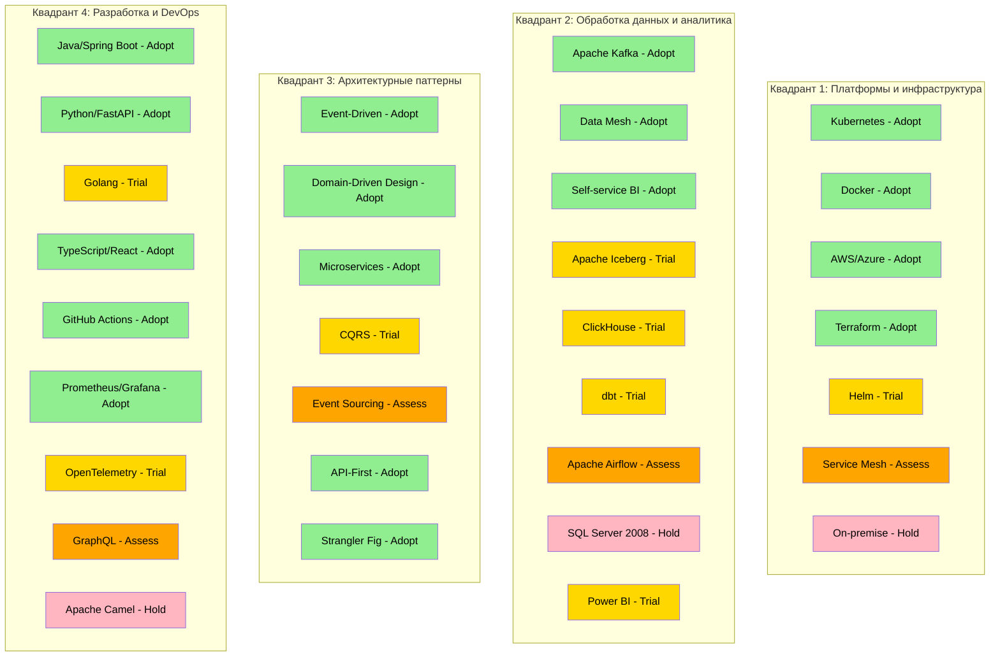

# Расширенный технический радар для компании "Будущее 2.0"

## Введение
Данный технический радар представляет собой расширенную версию, включающую не только технологии, но и архитектурные паттерны. Радар разделен на четыре квадранта с указанием статуса внедрения: **Adopt** (внедрять), **Trial** (испытывать), **Assess** (оценивать), **Hold** (удерживать).

## Квадранты радара

### 1. Платформы и инфраструктура
**Технологии для построения облачной платформы и инфраструктуры**

| Технология/Паттерн | Категория | Статус | Обоснование |
|-------------------|-----------|--------|-------------|
| **Kubernetes** | Контейнеризация | Adopt | Стандарт для оркестрации контейнеров, обеспечивает масштабируемость и отказоустойчивость |
| **Docker** | Контейнеризация | Adopt | Фактический стандарт для контейнеризации приложений |
| **AWS/Azure** | Облачные платформы | Adopt | Миграция в облако - стратегическое направление компании |
| **Terraform** | Infrastructure as Code | Adopt | Позволяет декларативно управлять инфраструктурой, уже используется в проекте |
| **Helm** | Управление K8s | Trial | Упрощает развертывание приложений в Kubernetes, требует оценки |
| **Service Mesh (Istio)** | Сетевая инфраструктура | Assess | Для сложных сценариев маршрутизации и observability, требует глубокой оценки |
| **VMware/On-premise** | Локальная инфраструктура | Hold | Постепенный отказ от локальной инфраструктуры в пользу облака |

### 2. Обработка данных и аналитика
**Технологии для работы с данными, аналитики и Data Mesh**

| Технология/Паттерн | Категория | Статус | Обоснование |
|-------------------|-----------|--------|-------------|
| **Apache Kafka** | Event Streaming | Adopt | Фундамент для событийно-ориентированной архитектуры |
| **Data Mesh** | Архитектурный паттерн | Adopt | Стратегическое направление для децентрализации данных |
| **Apache Iceberg** | Data Lake Format | Trial | Современный формат для data lakes с поддержкой транзакций |
| **ClickHouse** | Data Warehouse | Trial | Высокопроизводительная колоночная СУБД для аналитики |
| **Self-service BI** | Архитектурный паттерн | Adopt | Ключевое требование бизнеса - портал самообслуживания |
| **dbt (Data Build Tool)** | Трансформация данных | Trial | Современный подход к трансформациям данных, требует оценки |
| **Apache Airflow** | Оркестрация ETL | Assess | Для сложных пайплайнов данных, требует оценки сложности |
| **SQL Server 2008** | Legacy DWH | Hold | Устаревшая технология, планируется миграция |
| **Power BI** | BI инструмент | Trial | Уже используется, но требует интеграции с новой архитектурой |
| **Superset/Metabase** | BI инструменты | Assess | Альтернативы с открытым исходным кодом для оценки |

### 3. Архитектурные паттерны и подходы
**Архитектурные паттерны и методологии разработки**

| Технология/Паттерн | Категория | Статус | Обоснование |
|-------------------|-----------|--------|-------------|
| **Event-Driven Architecture** | Архитектурный паттерн | Adopt | Основа для слабосвязанной системы, соответствует долгосрочным целям |
| **Domain-Driven Design** | Методология | Adopt | Уже применяется в Task 4 для определения bounded contexts |
| **Microservices** | Архитектурный стиль | Adopt | Позволяет независимое развитие доменов |
| **CQRS (Command Query Responsibility Segregation)** | Паттерн | Trial | Для разделения операций записи и чтения в критичных доменах |
| **Event Sourcing** | Паттерн | Assess | Для доменов с требованием полного аудита изменений |
| **API-First Design** | Подход | Adopt | Обеспечивает согласованность API между доменами |
| **Strangler Fig Pattern** | Паттерн миграции | Adopt | Для постепенной миграции с легаси-систем |

### 4. Разработка и DevOps
**Инструменты разработки, языки программирования и DevOps практики**

| Технология/Паттерн | Категория | Статус | Обоснование |
|-------------------|-----------|--------|-------------|
| **Java/Spring Boot** | Бэкенд разработка | Adopt | Уже используется в компании, сильное комьюнити |
| **Python/FastAPI** | Бэкенд разработка | Adopt | Для ИИ-сервисов и аналитических задач |
| **Golang** | Бэкенд разработка | Trial | Уже используется в финтех-сервисах, высокая производительность |
| **TypeScript/React** | Фронтенд | Adopt | Для портала самообслуживания |
| **GitHub Actions/GitLab CI** | CI/CD | Adopt | Современные системы CI/CD для автоматизации |
| **Prometheus/Grafana** | Мониторинг | Adopt | Стандарт для мониторинга cloud-native приложений |
| **OpenTelemetry** | Distributed Tracing | Trial | Для end-to-end трассировки в распределенной системе |
| **GraphQL** | API технология | Assess | Для гибких запросов данных в портале самообслуживания |
| **Apache Camel** | Интеграция | Hold | Легаси-технология, постепенная замена на событийную шину |

## Визуализация радара

### Диаграмма распределения технологий по квадрантам

### Легенда цветов:
- 🟢 **Зеленый (Adopt)**: Рекомендуется к внедрению
- 🟡 **Желтый (Trial)**: Для пилотных проектов
- 🟠 **Оранжевый (Assess)**: Требует оценки
- 🔴 **Розовый (Hold)**: Отказаться или минимизировать

## Рекомендации по внедрению

1. **Приоритетные технологии (Adopt)**:
   - Начать с миграции в облако (AWS/Azure)
   - Внедрить Kubernetes для оркестрации контейнеров
   - Развернуть Apache Kafka как основу событийной шины
   - Применить Data Mesh и Domain-Driven Design для архитектуры

2. **Пилотные проекты (Trial)**:
   - Протестировать ClickHouse для аналитических нагрузок
   - Оценить dbt для трансформаций данных
   - Испытать Helm для управления развертываниями

3. **Долгосрочная стратегия**:
   - Постепенная миграция с легаси-систем
   - Развитие компетенций в области cloud-native технологий
   - Создание центра excellence для Data Mesh